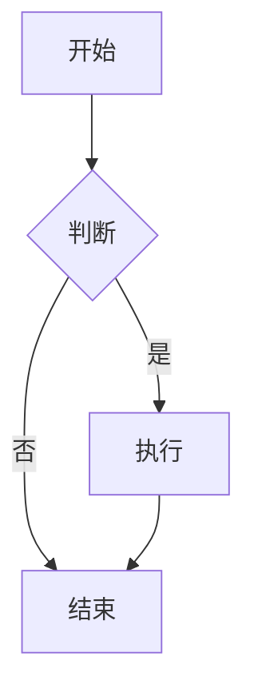

# Markdown 预览插件

多维表格边栏插件 - 选中单元格后渲染 Markdown 内容

## 功能特性

- 📝 实时预览：选中文本或 URL 单元格后自动渲染 Markdown 内容
- 🎨 支持 GFM：支持 GitHub Flavored Markdown 语法（表格、任务列表、删除线等）
- 🌗 主题适配：自动适配多维表格的浅色/深色主题
- 💡 代码高亮：支持多种编程语言的语法高亮
- 📊 Mermaid 图表：支持流程图、时序图、甘特图等
- 🔢 数学公式：支持 LaTeX 数学公式（KaTeX）
- 📋 复制功能：一键复制原始 Markdown 或渲染后的 HTML
- 🖥️ 全屏预览：支持全屏模式查看长内容

## 支持的 Markdown 语法

- 标题 (h1-h6)
- 粗体、斜体、删除线
- 有序列表、无序列表、任务列表
- 代码块和行内代码
- 表格
- 引用块
- 链接和图片
- 分隔线
- **Mermaid 图表**（流程图、时序图、甘特图等）
- **数学公式**（行内公式 `$...$`，块级公式 `$$...$$`）

## 使用方法

### 本地开发

1. 安装依赖
```bash
cd markdown-preview-plugin
npm install
```

2. 启动开发服务器
```bash
npm run dev
```

3. 在多维表格中添加自定义插件
   - 打开任意多维表格
   - 点击「插件」展开插件面板
   - 点击「自定义插件」 → 「+新增插件」
   - 输入运行地址：`http://localhost:8080`
   - 点击确定

4. 选中一个文本类型的单元格，插件会自动渲染其中的 Markdown 内容

### 打包发布

```bash
npm run build
```

打包后的文件在 `dist` 目录中，可以部署到任意静态服务器或提交到多维表格插件中心。

### 部署到 Vercel

#### 方式一：通过 Vercel CLI 部署

1. 安装 Vercel CLI
```bash
npm i -g vercel
```

2. 登录 Vercel
```bash
vercel login
```

3. 部署项目
```bash
cd markdown-preview-plugin
vercel
```

4. 按提示完成部署，获取部署 URL（如 `https://markdown-preview-plugin.vercel.app`）

#### 方式二：通过 GitHub + Vercel 自动部署

1. 将项目推送到 GitHub 仓库
2. 登录 [Vercel](https://vercel.com)
3. 点击 "New Project" → 导入 GitHub 仓库
4. Vercel 会自动检测 Vite 项目并配置好构建设置
5. 点击 "Deploy" 完成部署

#### 在多维表格中使用

部署成功后，将 Vercel 提供的 URL 填入多维表格的自定义插件地址即可使用。

## 项目结构

```
markdown-preview-plugin/
├── src/
│   ├── App.tsx         # 主组件，包含核心逻辑
│   ├── main.tsx        # 入口文件
│   └── index.css       # 样式文件
├── index.html          # HTML 模板
├── package.json        # 项目配置
├── tsconfig.json       # TypeScript 配置
└── vite.config.ts      # Vite 配置
```

## 技术栈

- React 18
- TypeScript
- Vite
- @lark-base-open/js-sdk - 多维表格 SDK
- react-markdown - Markdown 渲染
- remark-gfm - GFM 语法支持
- rehype-highlight - 代码高亮

## Mermaid 图表示例

在代码块中使用 `mermaid` 语言标识：

````markdown

````

## 数学公式示例

行内公式：`$E = mc^2$`

块级公式：
```markdown
$$
\int_{-\infty}^{\infty} e^{-x^2} dx = \sqrt{\pi}
$$
```

## 注意事项

- 支持文本类型和 URL 类型字段的 Markdown 渲染
- 请确保单元格中包含有效的 Markdown 内容
- Mermaid 图表渲染需要网络环境支持
- 数学公式使用 KaTeX 渲染，支持大部分 LaTeX 语法